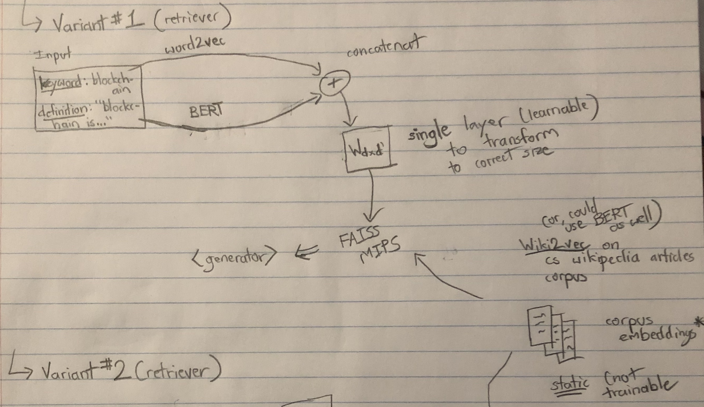
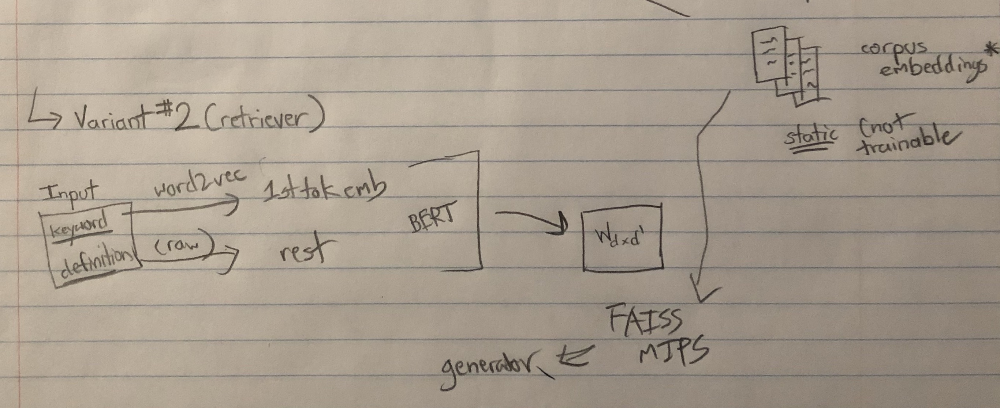

# Introduction

In this work, we tackle the task of outline generation for articles using a modified version of the Retrieval Augmented Generation framework [[1]](#1). Specifically, given some knowledge base of existing Wikipedia documents and a text input of the form

`<topic>: <description about topic>`

We aim to generate a list of possible subheadings for an article about this topic (e.g. ['Applications', 'History', 'Types']).

# Related work

Liu et al. [[4]](#4) try to directly generate entire wikipedia articles by framing the task as a sequence-to-sequence multi-document summarization task. Wikipedia articles are use as training data. The input documents for each article is the text of all the referenced works, and the target sequence is the article itself. This work uses an efficient variant of a transformer paired with some coarse selection techniques to account for the large size of the input and output text.

Sauper et al. [[5]](#5) generate structured articles by generating a universal template for articles within a certain topic (e.g. "diseases") and jointly try to populate content for each subheading in the template using a perceptron algorithm & ILP formation.

Zhang et al. [[6]](#6) propose the task of outline generation, which tries to generate an outline summary for any long document. The authors use a Markov dependency mechanism to first predict section boundries and then a corresponding heading for each section.

Yao et al. [[7]](#7) develop a story-generation model with improved coherence using a <i>plan-and-write</i> hierarchical generation framework: the model first generates a storyline and then writes a more detailed story using that storyline.

Banerjee et al. [[8]](#8) attempt to automatically generate Wikipedia articles by using vector representation of entities within articles to identify similar articles. Using these similar article, scraped web content is organized into sections using ILP-based abstractive summarization.

Drissi et al. [[9]](#9) attempt to improve the coherence of large outputs from nerual-based text generation models by first generating an outline to keep the model focused. The models start my generating topic sentences for the article, and then expand each setence to a full paragraph. The generators are based on a convolutional sequence-to-sequence model.

Zhu et al. [[10]](#10) tackle generating the abstract of a Wikipedia article using a topic-aware multi-document summarization approach. Each input document for an article is divided into different topic, and this distribution is used conditionally to generate a wikipedia abstract for that article.

Hua et al. [[11]](#11) enhance the coherence of Transformer-based text generators using content plans and iterative refinement: keyphrases are assigned to sentence-level positions following a sequence-to-sequence task formulation, then this plan is iteratively refined using BART.

# Architecture

## Baseline

As a baseline for this task, we train a T5 model to learn the sequence-to-sequence task of directly mapping from the text input to the section headings.

## Proposed Architecture

We chose to use a modified version of the RAG (Retrieval Augmented Generation) architecture. The main intuition behind RAG is to augment an input sequence with relevant context text from some knowledge base of documents and then train a generator to convert from this augmented input sequence to the desired output (i.e. the subheadings).

As shown in the above picture, the main components of the RAG architecture are the retreiver and the generator. Our main modifications are centered around the retriever. Specifically, we augment $q(x)$ by concatenating another feature vector representative of the input, say $v(x)$. We also augment $d(z)$ with the same kind of feature vector, i.e. $v(z)$. We add an additional fully connected layer on $q(x)$ after augmenting it to allow flexiblity in the dimensions for the query embedding and document / context embedding spaces.

Mathematically,

- $q'(x) = W \times (q(x) \bigoplus v(x))$
- $d'(z) = d(z) \bigoplus v(z)$

where $W$ is a learnable parameter, $v(x)$ is some additional features of $x$, and $\bigoplus$ is the vector concatenation operator. Note that $v(x)$ isn't limited to the text of the article $x$. It could rely on additional meta data about the article (e.g. graphical embedding of the article).

Additionally, unlike in the original RAG architecture, the text that is used to generate the representation of our context documents, $q(x)$, is different from the text that is passed down as input to the generator component. In the original RAG architecture and DPR works, the text used to generate the representation of documents and the text passed down as input to the generator component were the same.

By formatting our architecture this way, we are forcing the Retreiver part of our architecture to learn to fetch similar / relevant documents, and the generator to create a summarized outline from the outlines of several similar documents.

In a sense, this is like a learnable kNN model: the retriever learns to fetch similar documents based on some query embedding in a similar space (like fetching nearest neighbors), and the generator takes the outlines from these neighbors to generate the output (comporable to how the output is generated by looking at nearest-neighbors in kNN).

# Data Collection

Our training data consisted of wikipedia articles related to Computer Science. In practice, the training articles can be on arbitrary topics. For each article, we collected

- Article title
- Article abstract
- Top level subheadings

The top level subheadings would be the article's target sequence.

Articles were filtered by by obtaining a list of Computer Science keywords (mined from places such as arXiV and Springer), and checking whether there was a Wikipedia article corresponding to that keyword.

Out of around 18,000 computer science wikipedia articles, 40% were used to populate the knowledge base. The reamining 60% were split in a 80-18-2 ratio for train-test-val data for training the actual RAG architecture.

# Training

For our additional representation $v(x)$, we used a word2vec [[2]](#2) model (trained by Edward Ma). Note that we only used the title of each article (corresponding to some computer science keyword) to look up the corresponding vector representation to get $v(x)$.

Like the orignal RAG architecture, we keep the context representations fixed and finetune the question encoder as well as $W$ from the above equations. Training was done using the Adam optimizer.

# Results

In order to compare the generated subheadings with the ground truth subheadings, we used standard precision and recall metrics. Specifically, for a single article, we define

- $Prec = \frac {\text{\# of intersecting headings}} {\# of generated headings}$

- $Recall = \frac {\text{\# of intersecting headings}} {\text{\# of ground truth headings}}$

It is quite easy to generate metrics for an entire testing dataset by summing up the quantities over all articles in the set and taking the appropriate ratios. For initial experiments, two subheadings were considered to match if they matched exactly.

For ablation analysis, we also trained a model where only the modification of using different texts for representation and generator input in the encoding during the retrieval step was implemented.

Since there was a variability between articles, and our exact-match criteria might be considered to restrictive (e.g. "Applications" would not match "Uses and Apllications"), precision and recall for our models was quite low . For future work, a possible way to make the comparison more relaxed is to somehow group all similar headings and classify headings as matching if they belong in the same group.

# Pending work / Known Issues

- Experiment with using Wikipedia2Vec [[3]](#3) for $v(x)$

- Use approximate matching when comparing generated subheadings to ground-truth subheadings

- Learning rate / decoding method for last trained model produces repetitve results.

- Need to test on additional feature representations like word2vec.

- There was a second variant for extending the RAG that was never implemented / tested out. The main difference between this variant and the first variant was to pass in the word2vec embedding as the first token in the embedding layer of the BERT architecture.

[[11]](#11)

# References

<a id="1">[1]</a> Lewis, P., Perez, E., Piktus, A., Petroni, F., Karpukhin, V., Goyal, N., Küttler, H., Lewis, M., Yih, W.t., Rocktäschel, T., Riedel, S., & Kiela, D.. (2020). Retrieval-Augmented Generation for Knowledge-Intensive NLP Tasks.

<a id="2">[2]</a> Mikolov, T., Chen, K., Corrado, G., & Dean, J.. (2013). Efficient Estimation of Word Representations in Vector Space.

<a id="3">[3]</a> Yamada, I., Asai, A., Sakuma, J., Shindo, H., Takeda, H., Takefuji, Y., & Matsumoto, Y. (2020). Wikipedia2Vec: An Efficient Toolkit for Learning and Visualizing the Embeddings of Words and Entities from Wikipedia. In Proceedings of the 2020 Conference on Empirical Methods in Natural Language Processing: System Demonstrations (pp. 23–30). Association for Computational Linguistics.

<a id="4">[4]</a> Peter J. Liu*, Mohammad Saleh*, Etienne Pot, Ben Goodrich, Ryan Sepassi, Lukasz Kaiser, & Noam Shazeer (2018). Generating Wikipedia by Summarizing Long Sequences. In International Conference on Learning Representations.

<a id="5">[5]</a> Sauper, C., & Barzilay, R. (2009). Automatically Generating Wikipedia Articles: A Structure-Aware Approach. In Proceedings of the Joint Conference of the 47th Annual Meeting of the ACL and the 4th International Joint Conference on Natural Language Processing of the AFNLP (pp. 208–216). Association for Computational Linguistics.

<a id="6">[6]</a> Zhang, R., Guo, J., Fan, Y., Lan, Y., & Cheng, X. (2019). Outline Generation: Understanding the Inherent Content Structure of Documents. In Proceedings of the 42nd International ACM SIGIR Conference on Research and Development in Information Retrieval (pp. 745–754). Association for Computing Machinery.

<a id="7">[7]</a> Yao, L., Peng, N., Weischedel, R., Knight, K., Zhao, D., & Yan, R. (2019). Plan-and-Write: Towards Better Automatic Storytelling. Proceedings of the AAAI Conference on Artificial Intelligence, 33(01), 7378-7385. https://doi.org/10.1609/aaai.v33i01.33017378

<a id="8">[8]</a> Banerjee, S., & Mitra, P. (2016). WikiWrite: Generating wikipedia articles automatically. IJCAI International Joint Conference on Artificial Intelligence, 2016-January, 2740-2746.

<a id="9">[9]</a> Drissi, M., Watkins, O., & Kalita, J.. (2018). Hierarchical Text Generation using an Outline.

<a id="10">[10]</a> Zhu, F., Tu, S., Shi, J., Li, J., Hou, L., & Cui, T.. (2021). TWAG: A Topic-Guided Wikipedia Abstract Generator.

<a id="11">[11]</a> Hua, X., & Wang, L. (2020). PAIR: Planning and Iterative Refinement in Pre-trained Transformers for Long Text Generation. In Proceedings of the 2020 Conference on Empirical Methods in Natural Language Processing (EMNLP) (pp. 781–793). Association for Computational Linguistics.
